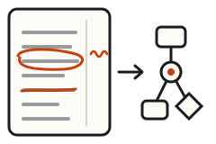
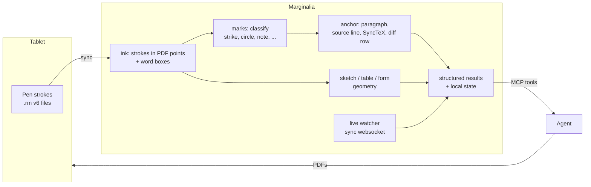

<p align="center">
  
</p>

<h1 align="center">Marginalia</h1>

<!-- mcp-name: io.github.comino/marginalia -->

<p align="center">
  <b>Your reMarkable as an AI agent front end.</b><br>
  Write, mark up and sketch with the pen. Agents get back structured, actionable results.
</p>

<p align="center">
  <a href="https://github.com/comino/marginalia/actions/workflows/ci.yml"></a>
  
  
  <a href="LICENSE"></a>
</p>

---

Other MCP servers give an agent *files* from your tablet. Marginalia gives it
the **meaning of your pen marks**. A strike-through becomes "delete these
words at line 42". A circle plus a margin note becomes a change request on
that paragraph. A tick becomes an answer, and a boxes-and-arrows sketch
becomes a Mermaid diagram.

The geometry, anchoring, state and recognition happen in the server, so even
small models can drive these workflows with a couple of tool calls.

## What you do on paper → what the agent gets

| Workflow | On the tablet | The agent gets |
|---|---|---|
| **Pen review** | Mark up a draft the agent sent (strike, circle, underline, margin notes) | Change requests with the exact source file line, then v2 with change bars |
| **Code review** | Mark up a pull request diff | GitHub review comments on `path:line` plus your verdict |
| **Thesis / LaTeX review** | Mark up the compiled PDF | Edits at `.tex` file:line, resolved through SyncTeX |
| **Forms and questions** | Tick, cross or circle answers | `{"publish": "Yes", "channels": ["LinkedIn"]}`, with no OCR needed |
| **Clarify** | Answer a question that shows you *your own* unclear mark | The resolved intent |
| **Triage sheets** | One tick per row for issues, PRs or mails | A decision per item, ready to apply |
| **Agent Inbox** | Write requests with `#tags`; strike one through to cancel | Tasks with stable ids; replies come back as a PDF |
| **Sketch → diagram** | Draw boxes, circles, diamonds and arrows | Nodes and edges, Mermaid, a clean SVG |
| **Tables, wireframes, math** | Draw a table, a UI wireframe or equations | Markdown/CSV, an HTML prototype, LaTeX |
| **Reading queue** | Highlight and annotate a clipped web article | Quotes with deep links back to the passage |
| **Live** | Just draw | Near-live changes as you write (`remarkable_live_watch`) |

Start every session with **`remarkable_whats_new`**. It lists everything that
changed across all workflows, with the next tool call for each item.

## Quickstart

```bash
# 1. Link the tablet (one-time code from https://my.remarkable.com/device/desktop/connect)
uvx --from "marginalia[web] @ git+https://github.com/comino/marginalia" marginalia --register CODE

# 2. Add it to Claude Code (any MCP client works; see docs/core.md)
claude mcp add --scope user remarkable -- \
  uvx --from "marginalia[web] @ git+https://github.com/comino/marginalia" marginalia

# 3. In a session, run one of the prompts
/mcp__remarkable__review_draft   /mcp__remarkable__tablet_check_in   /mcp__remarkable__triage_on_paper
```

Cloud mode, the default, needs a reMarkable Connect subscription. USB, SSH and
local-directory modes are described in [docs/core.md](docs/core.md).

## How it works



- **Geometry, not guessing.** Strokes are mapped into PDF coordinates with the
  device calibration and classified by shape. For example, *fill*
  distinguishes a circle from a scribble, and the line baseline distinguishes
  an underline from a strike-through. Tuned on real fineliner markup.
- **Everything is anchored.** Marks resolve to paragraphs and source lines for
  Markdown, `path:line:side` for diffs, `.tex` file:line via SyncTeX for
  LaTeX, and answer boxes with recorded geometry for forms.
- **Stateful and incremental.** The server remembers what it returned,
  stroke by stroke. A note added later next to an old mark comes back as new.
  State is local JSON; nothing is written to the tablet except new PDFs.
- **Handwriting.** Recognition uses [MyScript](https://developer.myscript.com)
  on the strokes, Google Vision or Claude on crops, or no backend at all, in
  which case the agent receives crops to read itself.

## Tools

<details>
<summary><b>Workflow tools</b> (29, plus 11 for TRMNL): open to expand</summary>

| Area | Tools |
|---|---|
| Overview | `remarkable_whats_new` |
| Pen review | `remarkable_review_send`, `remarkable_review_collect`, `remarkable_review_list`, `remarkable_annotations` |
| Forms | `remarkable_ask`, `remarkable_form_send`, `remarkable_form_read`, `remarkable_form_list`, `remarkable_clarify`, `remarkable_triage_send` |
| Inbox | `remarkable_inbox_setup`, `remarkable_inbox`, `remarkable_inbox_done` |
| Code / LaTeX | `remarkable_code_review_send`, `remarkable_code_review_collect`, `remarkable_latex_review_send`, `remarkable_latex_review_collect` |
| Structure | `remarkable_sketch`, `remarkable_regions`, `remarkable_table`, `remarkable_wireframe`, `remarkable_math` |
| Reading | `remarkable_clip`, `remarkable_reading_notes`, `remarkable_reading_list`, `remarkable_ink_digest` |
| Live | `remarkable_live_watch`, `remarkable_live_status` |
| TRMNL e-ink display | `trmnl_status`, `trmnl_set_slots`, … (11 tools, only when a TRMNL is configured) |

Full documentation: **[docs/workflows.md](docs/workflows.md)**.
</details>

<details>
<summary><b>Core tools</b>: read, search, render, export, upload, organise</summary>

`remarkable_read`, `remarkable_browse`, `remarkable_search`, `remarkable_recent`,
`remarkable_status`, `remarkable_image`, `remarkable_export`, `remarkable_upload`,
`remarkable_markdown_to_pdf`, `remarkable_mkdir`, `remarkable_move`,
`remarkable_rename`, `remarkable_delete`, `remarkable_canvas` (and
`remarkable_author` over SSH). Reference: **[docs/core.md](docs/core.md)**.
</details>

Prompts: `tablet_check_in`, `review_draft`, `ask_on_tablet`, `triage_on_paper`,
`meeting_pack`, `research_on_paper`, `daily_ink_digest`.

## Autopilot

`marginalia-autopilot` reacts to the tablet without anyone opening a session.
It watches the sync stream, mirrors a status line to a
[TRMNL](https://trmnl.com) display, and can optionally start a headless agent
when something needs attention. Run it as a systemd user service
([contrib/remarkable-autopilot.service](contrib/remarkable-autopilot.service));
details are in [docs/workflows.md#autopilot](docs/workflows.md#autopilot).

## Configuration

| Variable | Purpose |
|---|---|
| `REMARKABLE_TOKEN` / `~/.rmapi` | Cloud credential (`marginalia --register CODE` writes `~/.rmapi`) |
| `REMARKABLE_HANDWRITING_BACKEND` | `auto` (default), `myscript`, `google`, `claude`, `tesseract`, `none` |
| `MYSCRIPT_APPLICATION_KEY`, `MYSCRIPT_HMAC_KEY`, `MYSCRIPT_LANGUAGE` | Stroke-based recognition, the most accurate option (e.g. `de_DE`) |
| `GOOGLE_VISION_API_KEY` / `ANTHROPIC_API_KEY` (+ `REMARKABLE_HANDWRITING_MODEL`) | Image-based recognition |
| `REMARKABLE_WORKFLOW_STATE` | Local state directory (default `~/.local/state/remarkable-mcp`) |
| `REMARKABLE_REVIEW_FOLDER` | Tablet folder for reviews (default `/Review`) |
| `REMARKABLE_AUTOPILOT_CONFIG` | Autopilot config (default `~/.config/remarkable-mcp/autopilot.json`) |
| `TRMNL_CONFIG` / `TRMNL_PLUGIN_UUID` | TRMNL display (default `~/.config/trmnl/config.json`) |
| `REMARKABLE_READ_ONLY=1` | Nothing is written to the tablet or the TRMNL display (send/upload tools are not registered) |
| `REMARKABLE_ALLOWED_ROOTS` | Only read local files (drafts, PDFs, images) below these directories (`:`-separated) |
| `REMARKABLE_ALLOW_PRIVATE_URLS=1` | Let `remarkable_clip` fetch local/private network addresses (off by default) |

## Development

```bash
uv sync --all-extras
uv run pytest -q          # ~1080 tests, offline, about 60 s
uv run ruff check . && uv run ruff format --check .
```

The tests run without a tablet. Ink is synthesised as real v6 `.rm` files, and
a fake cloud client records uploads and serves annotated documents. Besides
per-feature tests, the suite includes:

- **Robustness:** seeded random and degenerate ink through every analyser, with
  time budgets for 2000-stroke pages.
- **Output validity:** Mermaid checked with the real Mermaid parser, strict
  HTML, the GitHub review payload shape, URL text fragments.
- **Failure modes:** rate limits, dropped sockets and token expiry for the live
  watcher; missing or hung agents for the autopilot.
- **Real tools:** real `git diff` and SyncTeX (skipped when TeX is missing).

Each round of features got an independent code review (six rounds so far,
including a whole-system security review and adversarial testing of the ink
classifiers), and every finding was fixed with a regression test. Metamorphic
tests pin down invariants: moving the page, reversing strokes, changing the
pen's sampling rate or adding tremor must not change what a mark means.

```
remarkable_mcp/
  workflows/     ink, marks, review, forms, inbox, sketch, table, wireframe,
                 code_review, latex_review, live, autopilot, handwriting, myscript, …
  trmnl/         TRMNL display client + tools
  *.py           core server, transports (cloud, SSH, USB web, local dir), extraction
docs/            workflows.md (workflow layer) · core.md (core tools) · …
tests/           pytest suite (offline; synthetic ink, fake cloud)
contrib/         systemd unit for the autopilot
```

## Credits

Marginalia builds on [remarkable-mcp](https://github.com/SamMorrowDrums/remarkable-mcp)
by **Sam Morrow**: the transports, sync client, extraction and rendering core
come from there. Thanks also to [rmscene](https://github.com/ricklupton/rmscene)
for the `.rm` format, [PyMuPDF](https://pymupdf.readthedocs.io/),
[rmapi-js](https://github.com/erikbrinkman/rmapi-js) for documenting the sync
notification socket, and MyScript's [iinkJS](https://github.com/MyScript/iinkJS).

Not affiliated with reMarkable AS. MIT licensed; see [LICENSE](LICENSE).
